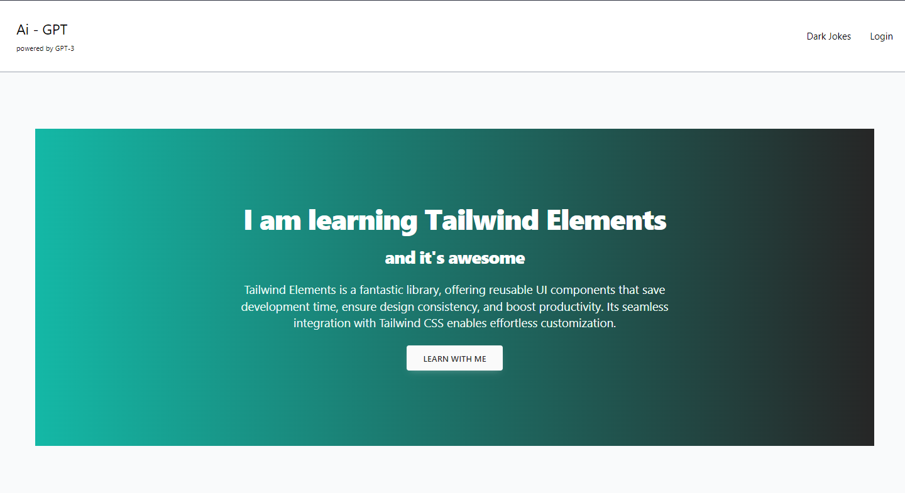

# GPT Started

# Feature
- Generate dark jokes
- Authentication module
- TailwindCSS training
- ...


# Setup 

> setup environment
```env
AUTH0_SECRET=
AUTH0_BASE_URL=
AUTH0_ISSUER_BASE_URL=
AUTH0_CLIENT_ID=
AUTH0_CLIENT_SECRET=

# in future
MONGODB_URI=

# in future
NEXT_PUBLIC_STRIPE_PUBLISHABLE_KEY=
STRIPE_SECRET_KEY=
STRIPE_WEBHOOK_SECRET=
```
Using the official [OpenAI](https://openai.com/api/) API. Get your [API key](https://beta.openai.com/account/api-keys)

## Getting Started

First, run the development server:

```bash
npm run dev
# or
yarn dev
# or
pnpm dev
```

## Technology Used
- NextJS
- React Icon
- Tailwind CSS
- OpenAI

## References
- [NextJS](https://nextjs.org/)
- [OpenAI API](https://platform.openai.com/docs/api-reference)
- [React Icon](https://react-icons.github.io/)
- [Tailwind CSS](https://tailwindcss.com/)